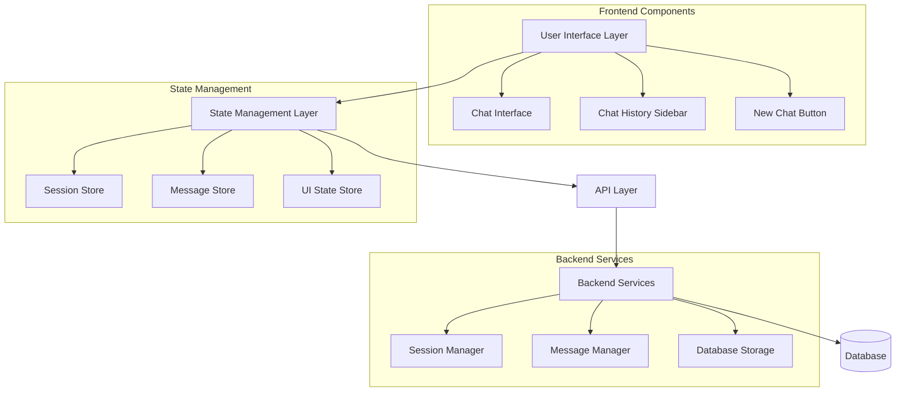

# Design Document

## Overview

This design document outlines the implementation of a robust chat session management system that provides clear separation between different chat conversations. The system builds upon the existing chat history infrastructure while enhancing the user interface to provide the exact behaviors specified in the requirements.

The design leverages the existing backend chat history module (Python) and frontend components (React/TypeScript) while implementing new UI behaviors and state management patterns to ensure complete session isolation and proper synchronization between the sidebar and main chat area.

## Architecture

### High-Level Architecture



### Component Architecture

The system consists of three main architectural layers:

1. **Presentation Layer**: React components for UI interaction
2. **State Management Layer**: Zustand stores for client-side state
3. **Service Layer**: Backend APIs and database operations

### Data Flow

1. User clicks "+ New Chat" → UI triggers state action → API call to create session → Update UI state
2. User clicks existing chat → UI triggers state action → API call to fetch messages → Update UI state
3. User sends message → UI triggers state action → API call to save message → Update UI state

## Components and Interfaces

### Frontend Components

#### Enhanced ChatInterface Component

**Purpose**: Main chat area that displays messages for the currently selected session

**Key Behaviors**:
- Displays only messages from the currently selected session
- Clears completely when a new session is created
- Updates immediately when switching between sessions
- Shows loading states during session transitions
- Handles error states gracefully

**Props Interface**:
```typescript
interface ChatInterfaceProps {
  currentSessionId: string | null
  messages: Message[]
  isLoading: boolean
  onSendMessage: (content: string, inputType: 'text' | 'voice') => Promise<void>
  onError: (error: string) => void
}
```

#### Enhanced ChatHistory Component (Sidebar)

**Purpose**: Sidebar that displays all chat sessions and handles session management

**Key Behaviors**:
- Shows all user sessions in chronological order (newest first)
- Highlights the currently active session
- Provides "+ New Chat" button at the top
- Allows session deletion and title editing
- Updates immediately when sessions are created or modified

**Props Interface**:
```typescript
interface ChatHistoryProps {
  sessions: ChatSession[]
  currentSessionId: string | null
  isVisible: boolean
  onSessionSelect: (sessionId: string) => void
  onNewChat: () => Promise<void>
  onDeleteSession: (sessionId: string) => Promise<void>
  onEditTitle: (sessionId: string, title: string) => Promise<void>
}
```

#### New Chat Button Component

**Purpose**: Dedicated button for creating new chat sessions

**Key Behaviors**:
- Creates a new session with unique ID
- Clears the main chat area
- Adds new session to top of sidebar
- Highlights the new session
- Shows loading state during creation
- Handles creation errors

### State Management

#### Enhanced ChatHistoryStore

**Purpose**: Manages all chat session and message state

**Key State Properties**:
```typescript
interface ChatHistoryState {
  // Session Management
  sessions: ChatSession[]
  currentSession: ChatSession | null
  isLoadingSessions: boolean
  
  // Message Management  
  currentMessages: Message[]
  isLoadingMessages: boolean
  
  // UI State
  isHistoryVisible: boolean
  error: string | null
  
  // Actions
  createNewSession: () => Promise<ChatSession | null>
  selectSession: (sessionId: string) => Promise<void>
  deleteSession: (sessionId: string) => Promise<void>
  sendMessage: (content: string, inputType: string) => Promise<void>
  clearCurrentMessages: () => void
  setError: (error: string | null) => void
}
```

**Key Behaviors**:
- Maintains complete separation between sessions
- Ensures UI synchronization between sidebar and main area
- Handles loading states for all operations
- Provides error handling and recovery
- Persists state changes to backend immediately

### Backend Services

#### Session Management Service

**Purpose**: Handles all session-related operations

**Key Methods**:
- `createSession(userId: number, title?: string): Promise<ChatSession>`
- `getUserSessions(userId: number): Promise<ChatSession[]>`
- `deleteSession(sessionId: string, userId: number): Promise<boolean>`
- `updateSessionTitle(sessionId: string, title: string): Promise<ChatSession>`

#### Message Management Service

**Purpose**: Handles all message-related operations

**Key Methods**:
- `getSessionMessages(sessionId: string, userId: number): Promise<Message[]>`
- `addMessage(sessionId: string, message: CreateMessageRequest): Promise<Message>`
- `clearSessionMessages(sessionId: string, userId: number): Promise<boolean>`

### API Endpoints

#### Session Endpoints

- `POST /api/chat-history/sessions` - Create new session
- `GET /api/chat-history/sessions` - Get user sessions
- `DELETE /api/chat-history/sessions/:id` - Delete session
- `PUT /api/chat-history/sessions/:id/title` - Update session title

#### Message Endpoints

- `GET /api/chat-history/sessions/:id` - Get session messages
- `POST /api/chat-history/messages` - Add message to session
- `DELETE /api/chat-history/sessions/:id/messages` - Clear session messages

## Data Models

### ChatSession Model

```typescript
interface ChatSession {
  id: string
  user_id: number
  title: string
  created_at: string
  updated_at: string
  last_message_at: string
  message_count: number
  model_used?: string
  is_active: boolean
}
```

### Message Model

```typescript
interface Message {
  id?: number
  session_id: string
  user_id: number
  role: 'user' | 'assistant' | 'system'
  content: string
  reasoning?: string
  model_used?: string
  input_type: 'text' | 'voice' | 'screen'
  metadata: Record<string, any>
  created_at?: string
  timestamp: Date
}
```

### UI State Models

```typescript
interface UIState {
  currentSessionId: string | null
  isCreatingSession: boolean
  isDeletingSession: boolean
  isLoadingMessages: boolean
  error: string | null
}
```

## Error Handling

### Error Types

1. **Session Creation Errors**
   - Network failures
   - Authentication errors
   - Server errors

2. **Session Loading Errors**
   - Session not found
   - Permission denied
   - Network timeouts

3. **Message Loading Errors**
   - Session not accessible
   - Database errors
   - Network failures

### Error Handling Strategy

#### Frontend Error Handling

```typescript
interface ErrorHandling {
  // Session creation failure
  onSessionCreationError: () => {
    // Show error message: "Could not start new chat"
    // Keep current chat unchanged
    // Allow user to retry
  }
  
  // Session loading failure
  onSessionLoadError: () => {
    // Show error message: "Could not load chat history"
    // Keep sidebar unchanged
    // Keep current session active
  }
  
  // Message loading failure
  onMessageLoadError: () => {
    // Show error in main chat area
    // Keep session selected in sidebar
    // Provide retry option
  }
}
```

#### Backend Error Handling

- Proper HTTP status codes for different error types
- Detailed error messages for debugging
- Graceful degradation for partial failures
- Transaction rollback for data consistency

### Error Recovery

1. **Automatic Retry**: For transient network errors
2. **User-Initiated Retry**: For persistent errors with retry buttons
3. **Graceful Degradation**: Show cached data when possible
4. **Error Boundaries**: Prevent complete UI crashes

## Testing Strategy

### Unit Tests

#### Frontend Component Tests

1. **ChatInterface Component**
   - Message display for different sessions
   - Message clearing on session switch
   - Loading state handling
   - Error state display

2. **ChatHistory Component**
   - Session list rendering
   - Session selection behavior
   - New chat button functionality
   - Session highlighting

3. **State Management Tests**
   - Session creation and selection
   - Message loading and clearing
   - Error state management
   - UI synchronization

#### Backend Service Tests

1. **Session Management**
   - Session creation with unique IDs
   - Session retrieval and filtering
   - Session deletion (soft delete)
   - Title updates

2. **Message Management**
   - Message persistence
   - Message retrieval by session
   - Message clearing
   - Context isolation

### Integration Tests

#### API Integration Tests

1. **Session Workflow Tests**
   - Create session → Select session → Add messages → Switch sessions
   - Verify complete isolation between sessions
   - Test error scenarios and recovery

2. **Message Workflow Tests**
   - Send message → Persist to database → Load in UI
   - Verify message ordering and context
   - Test different input types (text, voice, screen)

#### End-to-End Tests

1. **User Journey Tests**
   - Complete new chat creation flow
   - Session switching with message isolation
   - Error handling scenarios
   - UI synchronization verification

2. **Cross-Session Tests**
   - Verify no message leakage between sessions
   - Test concurrent session operations
   - Validate context separation

### Performance Tests

1. **Load Testing**
   - Large number of sessions
   - Sessions with many messages
   - Concurrent user operations

2. **Memory Testing**
   - Message cleanup on session switch
   - State management efficiency
   - Component re-rendering optimization

## Implementation Phases

### Phase 1: Enhanced State Management
- Upgrade ChatHistoryStore with new session isolation logic
- Implement proper message clearing and loading
- Add comprehensive error handling

### Phase 2: UI Component Updates
- Enhance ChatInterface for session isolation
- Update ChatHistory sidebar with new behaviors
- Implement New Chat button with proper state management

### Phase 3: Backend Integration
- Ensure API endpoints support required behaviors
- Add proper error responses and handling
- Implement session context validation

### Phase 4: Error Handling & Testing
- Implement comprehensive error handling
- Add loading states and user feedback
- Create comprehensive test suite

### Phase 5: Performance Optimization
- Optimize message loading and caching
- Implement efficient state updates
- Add performance monitoring