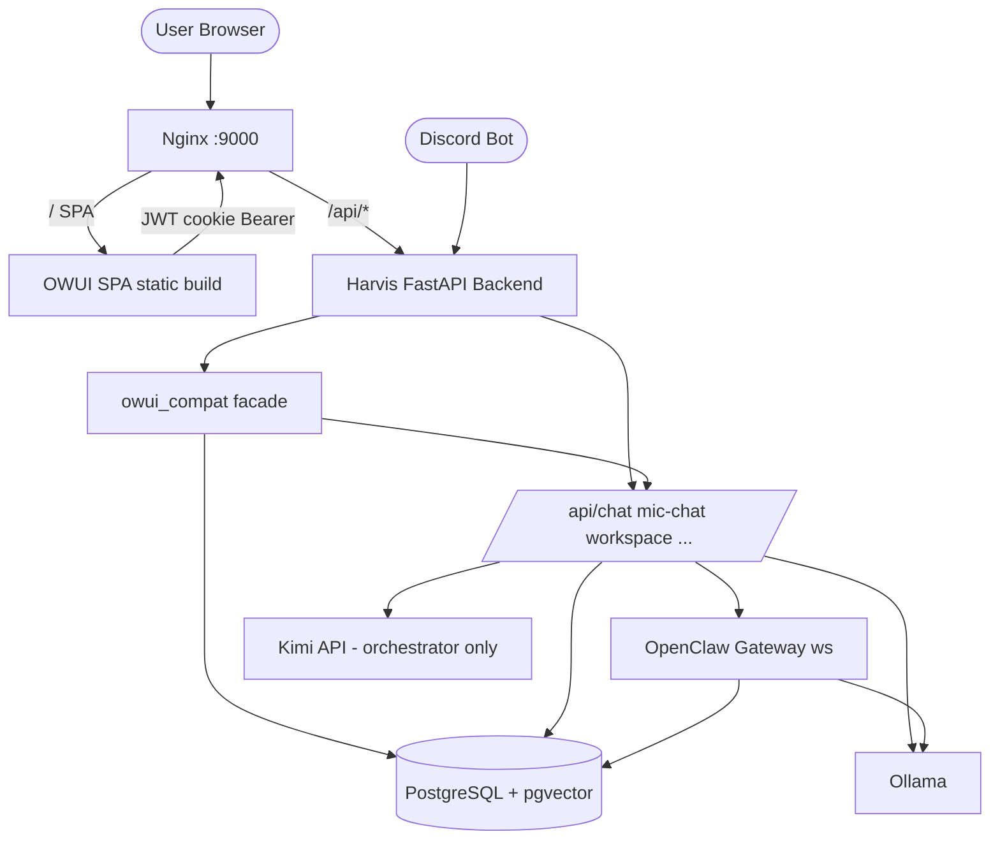
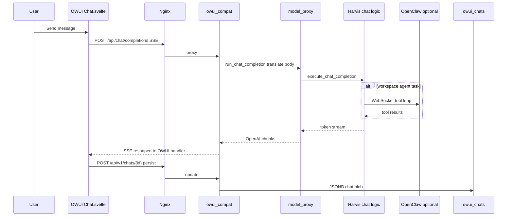

# Harvis × OpenWebUI — Information Architecture & Migration Blueprint

**Date:** 2026-05-31
**Scope:** Consolidated design blueprint based on what is already in the repo — the OWUI fork at `front_end/owui/`, the `owui_compat` backend facade, `newjfrontend` (what we are migrating from), and the handoff in `docs/handoffs/2026-05-31-owui-facade.md`.

---

## 0. Decided v2 design (2026-06-01) — the intended design, locked

> Consolidates the design decisions reached in review. **Supersedes the conceptual layout in §2 where they differ.** Build status: **doc only for now** — the "Agent Studio" sidebar pin + backend-ready wiring are scheduled next session.

**Model:** ChatGPT-familiar base + **progressive disclosure** — reveal power only when the user activates research / agents / files / coding. Harvis = "assistant + control room," not "another ChatGPT skin," and never "turn on OpenClaw mode."

**Layout**

```text
Top bar:  Harvis · model selector · Research · Agent (Auto) · Voice · user
Left:     New Chat · Search · Recent Chats · [Agent Studio] [Vibe Code] [Library]
Center:   chat thread + input  ([ + ] · mic · send)
Right rail (hidden by default; opens contextually):
          Activity · Reasoning · Sources · Files · Artifacts · Approvals
```

- **Top bar** = current-session controls (compact pills). **Input bar** = immediate actions; the `+` menu holds secondary actions (attach, image, use knowledge, start agent task, create document).
- **Right rail** = the control-room layer; auto-opens to the relevant tab (Sources on research, Activity on agents, Approvals on permission, Artifacts on create). Hidden in plain chat.
- **Naming (user-facing):** **Agent Studio** (execution) · **Vibe Code** (IDE) · **Library** (= OWUI `/workspace` config plane) · **Settings**. Never surface "OpenClaw" or OWUI's "Workspace" to normal users.

**Workspace interaction — NO toggle. Automatic detection + visible confirmation.**

Harvis already auto-detects workspace tasks (task detector / fast-path) → launches a run → streams typed events. The UI presents this as a **`WorkspaceRunCard` inside the chat** that expands progressively:

```text
chat message → WorkspaceRunCard (in chat) → Right-rail Activity → Agent Studio (full page)
```

Card states: **collapsed-thinking** (`◌ Thinking 45s · Planning…`) · **active** (current step + recent ✓/◌ activity + `[View activity] [Open Agent Studio] [Stop]`) · **long-thinking** (reassure: `Still working… last action: npm run build`) · **approval** (`⚠ Approval needed: run \`npm run build\` [Approve] [Deny]`) · **complete** (`✓ Workspace complete · 3 files · 7 tests · summary…`).

- Status text = **human phrases**, not raw event names (map `tool_call`→"Running command…", `agent_start`→"Starting helper agents…", etc.).
- The card **subscribes to the existing run event stream** — this is presentation, not new backend plumbing.

**Promotion rule** (all computable off the existing event stream):

| Condition | UI behavior |
|---|---|
| Thinking < 10s | tiny inline thinking indicator |
| Tool call < 30s | inline working card |
| > 3 tool calls | open right-rail Activity |
| Needs approval | open right-rail Approvals |
| Touches files / code | suggest Agent Studio |
| > 60s elapsed | make "Open Agent Studio" prominent |
| Multi-agent run | auto-open rail; suggest Studio |
| User clicks Agent Studio | full page |

**Routing** — OpenClaw is the *engine*; Agent Studio is the *product surface*. Panels (right rail, artifacts, reasoning) are **UI state, not routes**; full-page `/harvis/*` only for heavy surfaces.

```text
/                     normal chat
/c/[id]               chat history
/harvis/agent-studio  full workspace execution view
/harvis/vibecode      coding IDE
/workspace            Library / config plane (OWUI), labeled "Library"
/settings             settings
```

**Component to build:** `WorkspaceRunCard.svelte` (owns: status · elapsed · current step · recent events · approval · buttons · completion summary). Requires adding a **custom message/block type** to the OWUI fork's chat renderer (follow OWUI's existing artifact / tool-result rendering pattern). Higher effort than v1 facade — this is custom frontend, not config.

**Default flows:** simple Q → plain chat (no rail, no card). Task-like message → auto WorkspaceRunCard in chat → progressive promotion per the rule above. Coding → `/harvis/vibecode`.

**Deferred to next session:** (1) add the "Agent Studio" left-sidebar pin; (2) ready the backend wiring for the run-card stream (native `/api/workspace/*` — launch/stream/cancel + approvals).

---

## 1. Harvis brand vs OpenWebUI — what should feel different

**OpenWebUI** reads as a neutral, community chat shell: gray sidebar, generic "Open WebUI" identity, workspace = *admin config* (models, prompts, tools), not *agent execution*.

**Harvis** should read as an **orchestrated agent platform**: voice-first heritage, OpenClaw workspace, local models, security-isolated agents. The UI should signal "assistant + control room," not "another ChatGPT skin."

### Logo & mascot

You already have two brand assets:

| Asset | Location | Use |
|--------|----------|-----|
| Static logo SVG | `front_end/owui/static/harvis-logo.svg` | Favicon, sidebar collapsed, login, About |
| Animated mascot | `newjfrontend/components/mascots/HarvisMascot.tsx` | Empty states, loading, voice active, errors (port to Svelte or embed as Lottie later) |

**Visual language (from existing Harvis work):**

- **Primary accent:** teal/cyan (`#4FD1C5` → `#319795` in logo; OKLCH `0.72 0.15 200` in `newjfrontend/app/globals.css`)
- **Surfaces:** deep blue-black (`oklch(0.09…)`), not OWUI's flat gray
- **Typography:** Geist (newjfrontend) — keep in OWUI via `app.html` / Tailwind
- **Personality:** small robot with antenna glow — use sparingly (login, empty chat, workspace idle), not on every message bubble

**Naming:** `APP_NAME = 'Harvis'` is already in `front_end/owui/src/lib/constants.ts`. Finish branding per handoff #46: strip "Open WebUI" from i18n, About, manifest, and add a **`harvis-dark`** theme (map OWUI CSS vars to your OKLCH palette instead of inventing a third look).

### Design principles (decision checklist)

1. **Shell = OWUI routes; soul = Harvis tokens + mascot + agent panels**
2. **Never show "Open WebUI" in user-visible strings** — product is Harvis; OWUI is implementation detail
3. **Agent workspace is a first-class surface**, not buried in chat settings (this is the main product difference from stock OWUI)
4. **Harvis-only flows get Harvis components** (workspace split, research chain, agent graph) — do not force-fit into OWUI's generic message renderer until Phase 3

---

## 2. Information architecture — what goes where

Think in **three layers**: **Chat shell** (OWUI), **Harvis agent surfaces** (custom routes/panels), **Admin/workspace config** (OWUI workspace).

### Recommended layout map

```text
┌─────────────────────────────────────────────────────────────────────────┐
│  Top bar: model selector · Web Research toggle · voice · user menu      │
├──────────┬──────────────────────────────────────────────┬───────────────┤
│ Sidebar  │  Main canvas                                  │  (optional)   │
│          │                                               │  right rail   │
│ Chats    │  Route-dependent:                             │               │
│ Folders  │  • /           → Chat thread                  │  Reasoning    │
│ Search   │  • /c/[id]     → Chat thread                  │  Artifacts    │
│          │  • /harvis/…   → Harvis-only full pages       │  (Phase 2)    │
│ Pinned:  │  • /workspace  → OWUI admin (models/tools…)   │               │
│  Agent   │  • /vibecode   → IDE (Harvis route)           │               │
│  Studio  │  • /notes      → Notebook (if enabled)        │               │
│  Vibe    │                                               │               │
│  Code    │  When agent active: split view                │               │
│          │  [Chat narrow | Workspace panel wide]         │               │
└──────────┴──────────────────────────────────────────────┴───────────────┘
```

### Feature placement table

| Capability | Today (`newjfrontend`) | Target in OWUI shell | Notes |
|------------|------------------------|----------------------|--------|
| **Chat + streaming** | `/` + Vercel AI SDK | `/` + patched `Chat.svelte` (HTTP SSE) | Core; facade handles completions |
| **Chat history / folders** | `chat-sidebar` | OWUI sidebar + `owui_chats` table | Facade persistence exists |
| **Model picker** | Custom selector | OWUI model selector → `/api/models` | Facade translates Harvis models |
| **OpenClaw agent workspace** | `WorkspaceLayout` + `WorkspacePanel` | **`/harvis/workspace`** or slide-over from chat | **Keep split-view UX** from overhaul doc — do not put in OWUI "Workspace" admin |
| **Agent graph** | React Flow in workspace | Same route, tab "Agents" | Harvis-only |
| **Web research** | Toggle + `/api/research-chat` | Top bar toggle → native Harvis API (not OWUI web search) | Facade has `enable_web_search: false` intentionally |
| **Voice / mic** | `/api/mic-chat` | Input bar mic → Harvis endpoint | Wire outside OWUI STT until you implement audio in facade |
| **Reasoning / thinking** | Inline + insights | Message footer "Reasoned Ns" expand | Port UX from Phase 1 overhaul |
| **Research chain UI** | `research-chain.tsx` | Custom message block or side panel | Parse Harvis stream metadata |
| **Plugins** | `BlockPluginStack` | **`/harvis/plugins`** or floating bubbles on chat | OWUI "Tools" ≠ Harvis plugins |
| **Vibe coding IDE** | `/vibecode` | **`/harvis/vibecode`** (pinned sidebar) | Heavy Monaco/xterm — separate route |
| **Settings** | `/settings`, `/settings/openclaw`, `/profile` | **Consolidate**: OWUI Settings modal + tab "OpenClaw" | One hub per overhaul doc |
| **Auth** | JWT localStorage | OWUI signin → `/api/v1/auths/*` | Facade maps to Harvis users |
| **OWUI Workspace admin** | N/A (was custom settings) | `/workspace/models`, `/prompts`, `/tools`, `/knowledge`, `/skills` | **Config plane** for admins/power users |
| **Admin panel** | Partial | `/admin/*` | Enable gradually via `build_config()` flags |
| **Discord / swarm** | Backend + workspace events | Workspace panel + notifications | No OWUI equivalent |
| **Document generator** | Monolith component | Phase 3: `/harvis/documents` or plugin | Defer until chat shell stable |

### Critical naming distinction

- **OWUI "Workspace"** (`/workspace/*`) = library of models, prompts, tools, RAG collections — **configuration**.
- **Harvis "Agent Workspace"** = live OpenClaw run, tool calls, approvals, graph — **execution**.

In the sidebar, label them differently in copy, e.g. **"Library"** (or keep "Workspace" for OWUI) vs **"Agent Studio"** for Harvis execution. That avoids the #1 confusion users will have coming from OpenWebUI.

### OWUI sidebar pins (from `Sidebar.svelte`)

Default pins: `notes`, `workspace`. For Harvis v1, consider:

```text
Pinned menu (user-sortable):
  1. Agent Studio   → /harvis/workspace
  2. Vibe Code      → /harvis/vibecode
  3. Library        → /workspace        (OWUI admin)
  4. Notes          → /notes            (when notebook phase lands)
```

Disable in `build_config()` until implemented: `automations`, `calendar`, `playground`, `channels` — already off in `owui_compat/config.py`.

---

## 3. Data flow diagram (DFD)

### Level 0 — system context



### Level 1 — chat message flow (OWUI path)



### Level 1 — Harvis-only features (bypass facade today)

```mermaid
flowchart LR
    subgraph OWUI_shell
        Chat[Chat UI]
        HarvisRoutes["/harvis/* Svelte routes"]
    end

    subgraph Facade_v1
        Auth[/api/v1/auths/]
        Models[/api/models]
        Complete[/api/chat/completions]
        Chats[/api/v1/chats/]
        Config[/api/config]
    end

    subgraph Harvis_native
        Mic[/api/mic-chat]
        Research[/api/research-chat]
        WS[/api/workspace/*]
        Vibe[/api/vibecode/]
        Swarm[/api/swarm]
        OpenClawAPI[/api/openclaw/*]
    end

    Chat --> Facade_v1
    HarvisRoutes --> Harvis_native
```

New Harvis UI modules should call **native** endpoints directly (with Bearer), not wait for facade parity unless you need OWUI's data shapes.

### Data stores

| Store | Contents | Used by |
|-------|----------|---------|
| `users` | Auth | Facade + native |
| `owui_chats` | OWUI-shaped chat JSON | Facade only |
| `chat_history` / sessions (legacy) | old newjfrontend | Migration candidate |
| `openclaw_sessions` / messages | Agent runs | OpenClaw + workspace APIs |
| pgvector | RAG, skills | Researcher, `local_rag` |

---

## 4. Migration plan (phased)

### Phase 0 — Shell online (in progress per handoff)

- [x] Vend OWUI v0.9.5 → `front_end/owui/`
- [x] `owui_compat` facade (18 routes)
- [x] SSE patch in `Chat.svelte`
- [ ] Branding + `harvis-dark` theme
- [ ] `npm run build` + Nginx serves `build/` at `/`
- [ ] E2E: signup → chat → stream → reload chat

**Exit criteria:** Users can log in and chat with Ollama models; no Socket.IO dependency.

### Phase 1 — Harvis differentiators on the shell (2–4 weeks)

Priority from `docs/reports/2026-05-29-ui-overhaul-scope.md`:

1. **Agent Studio route** — port `WorkspaceLayout` + `WorkspacePanel` (split view); wire `/api/workspace/stream` SSE
2. **Top bar** — Web Research toggle → `/api/research-chat` (not OWUI search)
3. **Reasoning affordance** — Harvis `<think>` separation in custom message renderer
4. **Settings hub** — OpenClaw tab inside OWUI settings modal
5. **Auth audit** — Bearer on all native calls from new Svelte routes

**Keep from newjfrontend:** split-view, streaming, plugin pattern, agent graph — **do not** drop these for OWUI minimal chat.

### Phase 2 — Facade expansion + config plane

- Flip `build_config()` flags as routes are implemented (`enable_notes`, etc.)
- Map OWUI **Library** tabs to Harvis backends (models already via `/api/models`; tools/skills → Harvis skill registry)
- Chat history migration script: `chat_history` → `owui_chats` (one-time ETL per user)
- Optional: embed Harvis mascot in OWUI `ChatPlaceholder.svelte`

### Phase 3 — Deprecate `newjfrontend`

- Redirect any bookmarked routes
- Remove Next.js from default deploy path (keep folder for reference until stable)
- Split monoliths (DocumentGenerator, etc.) only if still needed

### Phase 4 — Open Notebook / advanced surfaces

- `masterprompt4.md` notebook UI → `/notes` when SurrealDB/notebook backend is ready
- Separate from Agent Studio

### Migration decision matrix

| newjfrontend piece | Strategy |
|--------------------|----------|
| Chat page | **Replace** with OWUI chat + facade |
| Workspace panel | **Port** to `/harvis/workspace` |
| Vibecode | **Port** route + keep APIs |
| Plugins | **Port** as Harvis route/modal |
| API proxy routes in `app/api/*` | **Remove** — browser calls Nginx `/api/*` directly |
| Zustand stores | **Rewrite** as Svelte stores or thin TS modules |
| React Flow graph | **Keep React** in a Svelte island or rebuild in SvelteFlow later |

---

## 5. Practical next steps (design deliverables)

If you want this turned into an official design doc in the repo, a single `docs/design/harvis-owui-ia-and-migration.md` with the diagrams above plus a **Figma/token sheet** would be the artifact. For now, the decisions worth locking in a short design review:

1. **Rename in UI:** OWUI Workspace → **"Library"**; Harvis execution → **"Agent Studio"**
2. **Theme:** one `harvis-dark` theme file mapping OWUI CSS variables to OKLCH tokens from `newjfrontend/app/globals.css`
3. **Route prefix:** all Harvis-only pages under `/harvis/*` so OWUI upstream merges stay predictable
4. **Facade scope:** v1 = auth, models, chat SSE, chat CRUD; everything agent/voice/research stays **native Harvis APIs**

---

## 6. What is already wired vs still open

| Area | Status |
|------|--------|
| OWUI fork + SSE chat patch | Done (build not verified) |
| Backend facade | Done (needs image rebuild on live stack) |
| `harvis-logo.svg`, `APP_NAME` | Partial |
| Nginx → OWUI static | Configured in `nginx.conf` |
| Agent workspace in OWUI | **Not started** — still only in `newjfrontend` |
| Brand theme `harvis-dark` | **Not started** |
| i18n "Open WebUI" purge | **Not started** |

---

If you want to go deeper next, the highest-value follow-ups are: (1) a **wireframe** for Agent Studio split-view inside OWUI's layout, or (2) a **concrete route list** (`/harvis/*` Svelte files to create). Say which you prefer and we can draft it file-by-file against `front_end/owui/src/routes/`.
