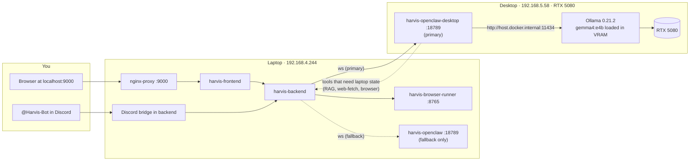

# Desktop GPU Routing — Harvis ↔ OpenClaw on the 5080

How Harvis offloads agent work from the laptop to the Windows desktop with the
RTX 5080, with automatic fallback to the local container when the desktop is
unreachable.

## TL;DR

- **Laptop** (`192.168.4.244`) runs Harvis: frontend, backend, Discord bot,
  browser-runner, plus a *bundled* OpenClaw container as the safety net.
- **Desktop** (`192.168.5.58`) runs OpenClaw + native Ollama. It is the agent
  runtime and the model inference engine. The 5080 does the actual thinking.
- A WebSocket from the laptop backend to `ws://192.168.5.58:18789` carries the
  task. If that WS fails to connect, the backend silently retries against
  `ws://openclaw:18789` (the local bundled container) — the user never sees an
  error.

## Architecture



Solid arrows = normal request path. Dotted arrows = secondary paths (failover
or callbacks).

## Per-message flow

1. You send a message in the browser at `http://localhost:9000` or `@Harvis-Bot`
   in Discord.
2. The laptop backend (`harvis-backend`) opens a WebSocket to
   `ws://192.168.5.58:18789` (desktop). On connection failure it transparently
   retries against `ws://openclaw:18789` (laptop local).
3. The active OpenClaw gateway dispatches the task to its agent and starts a
   tool loop. For inference it calls
   `http://host.docker.internal:11434` — that is the **native Ollama on the
   desktop** when on the primary path, or the laptop's Ollama when on fallback.
4. Tools the agent calls (`exec`, `browser`, `web-fetch`, `rag_search`, etc.)
   may need state that lives on the laptop. Those tools curl
   `http://backend:8000/...` which is mapped via `extra_hosts` on the desktop
   container to the laptop's LAN IP.
5. Events stream back over the same WebSocket. The backend renders them into
   the chat UI (or posts the final answer to Discord).

The first message after a reboot pays a one-time ~5–10 s cost while Gemma
cold-loads into VRAM. After that, prompts feel snappy.

## Failover behavior

Implemented in
`python_back_end/workspace/openclaw_client.py` — `_connect()` tries the
primary URL first, and on any of `OSError` / `asyncio.TimeoutError` /
`ConnectionError` / `WebSocketException` retries against
`OPENCLAW_FALLBACK_URL`. The instance then sticks with whichever endpoint
worked for any reconnects in the same stream.

Triggers fallback:
- Desktop powered off, asleep, or rebooting
- WiFi between laptop and desktop drops the WS handshake
- Desktop OpenClaw container crashed or restarting
- Network policy / firewall blocking 18789

Does **not** trigger fallback (yet):
- An in-session error after the WS is up (e.g. EACCES, model error). The
  current container init fixes the EACCES class of bug; if other in-session
  errors become a problem we extend `stream()` similarly.

## Day-to-day operations

### Start everything

| Scenario | Action |
|---|---|
| Both machines just rebooted | Bring laptop up first: `cd ~/Projects/Recent-EX/Harvis && docker compose up -d`. Desktop self-heals on its own (Docker Desktop autostart → container `restart: unless-stopped`). |
| Laptop only rebooted | `cd ~/Projects/Recent-EX/Harvis && docker compose up -d` |
| Desktop only rebooted | Nothing. Backend will reconnect automatically once the desktop's WS is back up. |

### Verify health

```bash
# From laptop host
curl -s http://localhost:9000/api/health/services | jq

# Confirm desktop is reachable
( exec 3<>/dev/tcp/192.168.5.58/18789 && echo OPEN ) 2>/dev/null

# Confirm desktop is actually doing the work (real round-trip)
docker exec harvis-backend python3 /tmp/confirm.py   # if the helper is still in /tmp
```

`openclaw: 404` in the health JSON is normal — the WS gateway has no HTTP
`/health` endpoint. As long as the TCP probe above prints `OPEN`, the desktop
is good.

### Use it

- Web UI: <http://localhost:9000>
- Discord: `@Harvis-Bot` in your server

### Editing skills or OpenClaw config on the desktop

Bundle lives at `/home/harvis/harvis-host/` inside the Ubuntu WSL2 distro on
the desktop.

```powershell
# From Windows Explorer:
\\wsl.localhost\Ubuntu\home\harvis\harvis-host\
```

After editing files, restart the desktop OpenClaw container so it picks them
up:

```powershell
ssh memel@192.168.5.58 "wsl -d Ubuntu --user harvis -e bash -c 'cd ~/harvis-host && docker compose restart openclaw'"
```

### Revert to laptop-only

Delete these three lines from `~/Projects/Recent-EX/Harvis/.env` and
`docker compose up -d backend`:

```
OPENCLAW_URL=ws://192.168.5.58:18789
OPENCLAW_BUNDLED_URL=ws://192.168.5.58:18789
OPENCLAW_FALLBACK_URL=ws://openclaw:18789
```

## File locations cheat sheet

### Laptop (`/home/ommblitz/Projects/Recent-EX/Harvis/`)

| Path | What |
|---|---|
| `.env` | Routing knobs: `OPENCLAW_URL`, `OPENCLAW_FALLBACK_URL`, `OPENCLAW_GATEWAY_TOKEN` |
| `docker-compose.yaml` | Parameterized `OPENCLAW_*` envs for backend |
| `python_back_end/workspace/openclaw_client.py` | `_connect()` failover logic |
| `python_back_end/workspace/openclaw_resolver.py` | Bundled vs BYO routing per user |

### Desktop (`/home/harvis/harvis-host/` inside Ubuntu WSL2)

| Path | What |
|---|---|
| `docker-compose.yml` | `openclaw-init` (perm fix) + `openclaw` services |
| `.env` | `OPENCLAW_GATEWAY_TOKEN` (must match laptop) |
| `openclaw.json` | OpenClaw agent config (model, tools, limits) |
| `AGENT.md`, `IDENTITY.md`, `SOUL.md`, `USER.md` | Identity bundle |
| `skills/harvis-*` | Skill docs the agent loads |
| `exec-approvals.json` | Allowed shell commands |

Named volume `harvis-host_openclaw-data` (in Docker's ext4 storage) holds
runtime state under `/home/node/.openclaw/`. The init container chowns this
to uid 1000 on every `up`, which fixes the EACCES bug we hit on first deploy.

## Tokens and security

- The same `OPENCLAW_GATEWAY_TOKEN` is configured on both desktop and laptop
  (`.env` files). The gateway's `connect.challenge` handshake validates it.
- The desktop gateway listens on `0.0.0.0:18789` — anyone on
  `192.168.5.0/24` can reach the TCP port. Authentication is the token.
  Rotate it by setting a new value in **both** `.env` files and restarting
  both `harvis-backend` (laptop) and `harvis-openclaw-desktop` (desktop).

## Troubleshooting

| Symptom | First thing to check |
|---|---|
| Tasks suddenly slow or simple | Probably on fallback. Check backend logs for `Primary OpenClaw … failed … falling back to`. Then ping desktop, check `docker ps` on desktop. |
| `OPEN` from `/dev/tcp/192.168.5.58/18789` but tasks fail | Check desktop OpenClaw logs: `wsl -d Ubuntu --user harvis -e docker logs harvis-openclaw-desktop --tail 100`. Likely token mismatch (re-sync) or tool-call error. |
| Desktop unreachable on LAN | WiFi blip — ping it. If desktop just rebooted, give Docker Desktop ~30 s. |
| Desktop perms regression (EACCES) | The `openclaw-init` service didn't run. `docker compose down && docker compose up -d` from `/home/harvis/harvis-host/` to force init to re-execute. |

## Related

- `docs/byo-openclaw-setup.md` — original BYO OpenClaw concept (per-user)
- `CLAUDE.md` § "OpenClaw Integration" — security model and architectural
  invariants this routing setup must respect
