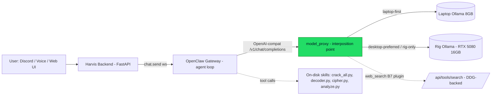
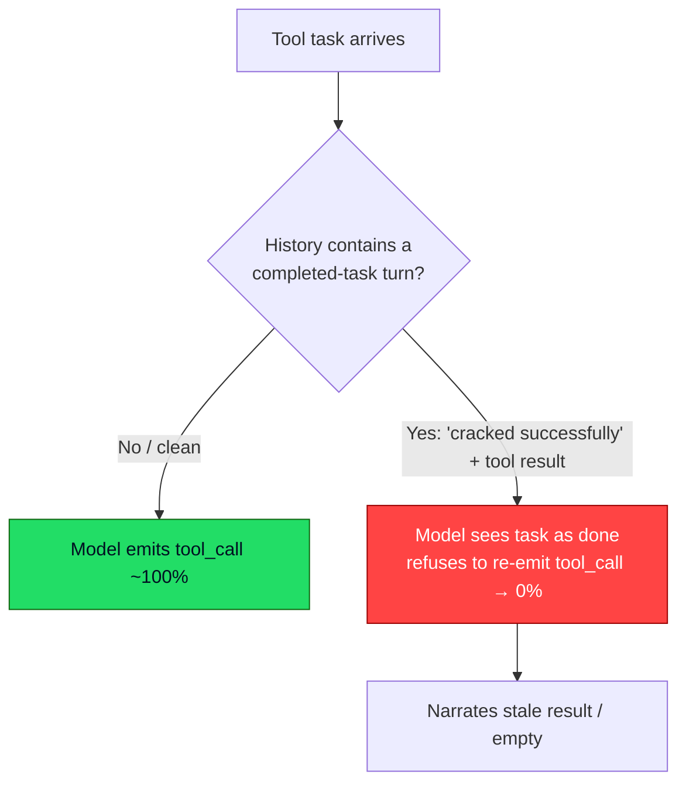

# Harvis Agent Reliability — Engineering Troubleshooting & Resolution Report

**Period:** 2026-05-06 → 2026-05-29
**Branch:** `feat/hermes-integration`
**Scope:** All infrastructure/middleware troubleshooting, root-cause analyses, and changes implemented while making Harvis's local-model agent loop reliable for tool-using tasks (hash cracking, decode, crypto, forensics, web research) over Discord and the web UI.
**Companion doc:** model-specific testing and behavioral difficulties are in `2026-05-29-model-testing-and-difficulties.md` (separate, per request).

---

## 1. Executive summary

Harvis orchestrates local LLMs through an OpenClaw agent gateway to run multi-step tool tasks. Over this period we hit, diagnosed, and resolved a long chain of reliability failures. They *looked* like model-quality problems; the decisive finding at the end was that the single largest failure class was **infrastructure-induced context contamination**, not the models.

Headline resolutions:

1. **Skill-dispatch architecture ("Lever 1")** — stopped asking models to author multi-step Python inside a tool call; they now invoke a tested on-disk script. Eliminated the indent-collapse failure class.
2. **Removed `tool_choice` forcing** — Ollama silently ignores it at production prompt complexity; forcing was net-negative.
3. **Reasoning→content hoist** — salvages answers that thinking-mode models route into the wrong response field.
4. **Context-hygiene fix** — clears completed-task history (server-side `sessions.reset` + rendered-history drop) before tool tasks, which the harness proved was the root cause of the entire "flaky model" saga.
5. **Custom `web_search` MCP plugin (B7)** + **OpenClaw v4 migration** — gave every model a working schema-registered web tool.

A diagnostic **harness** (`scripts/diagnostics/model_harness.py`) was the turning point: it converted multi-session guesswork into reproducible numbers and overturned a wrong conclusion in its first hour.

---

## 2. System architecture



**The load-bearing design fact:** `model_proxy` sits *between* OpenClaw and Ollama (the `harvis-proxy` provider). It sees and can deterministically rewrite **every** inference request/response. Every reliability fix that works (hoist, escape-normalize, markdown-rescue, forcing-removal, num_ctx control) lives at this chokepoint. A sibling Harvis build that lacked this interposition point had *no* way to fix these failure modes — confirming the architecture's value.

---

## 3. Issue catalogue (symptom → root cause → resolution)

| # | Issue | Severity | Root cause | Resolution | Commit(s) |
|---|---|---|---|---|---|
| 1 | 8–9B Q4 models spill to CPU on the 8GB GPU | infra ceiling | Q4 weights + KV cache + overhead > 8GB | Cap `num_ctx`; route GPU-heavy models to the 16GB rig; keep small models on laptop | `f3fa79c` |
| 2 | Directive ~13K tokens; slow prefill | perf | Identity bundle + 28 tool schemas + skill hints | Trim AGENT.md (67%), cut tool schema 28→6 via `tools.allow`, `KEEP_ALIVE=-1` | `b12b757`, B7 work |
| 3 | "NO" / refusal on CTF briefs | model-align | Safety-aligned refusal on "password dumps / hacker" framing | Kept hints short (long defensive preambles made it *worse* — reverted) | reverted, no commit |
| 4 | Models narrate tool use instead of calling tools | reliability | Small models emit fake ```json``` tool calls as text, or chain silently | Markdown tool-call rescue + synthesized narrative + narration-retry | `cce0623`, `61b7a51`, B7 |
| 5 | Fabricated "cracked" results with 0 tool calls | correctness | Model invents plaintext / process narrative | Deterministic `_validate_hash_claims` + CTF process-claim validator (recompute hashes, suppress fabrications) | `b12b757`, `427d06c`, `a0cfa59`, `2379af0` |
| 6 | OpenClaw v4 pairing wall | infra | v4 removed `skipPairingForOperatorSharedAuth`; backend connects from docker bridge, not loopback | Direct atomic write of an approved entry into `paired.json` (no HMAC; shared-token auth) | `774f8dd` |
| 7 | v4 exec-approval gate (EBUSY) | infra | `exec-approvals.json` single-file bind mount can't be atomically renamed | Removed bind mount; file lives in the volume, seeded on boot | `774f8dd` |
| 8 | `tool_choice` forcing not enforced | architecture | Ollama silently drops pin-to-function AND `"required"` above trivial prompt complexity | Removed all forcing; kept `auto` + detection-only telemetry | `c8dc50b`, `638fb5b` |
| 9 | Tool-call arg escape-leak | reliability | Models double-escape newlines in `write`/`exec` args | String-aware escape normalizer in `model_proxy` | B7 (`774f8dd`) |
| 10 | Indent-collapse on hash CodeAct | model + arch | Models emit 1-space indent at every nesting depth inside heredoc Python → `IndentationError` | **Lever 1** — dispatch to on-disk `crack_all.py`; model emits one short command, authors no Python | `848ccf8` |
| 11 | Thinking-mode answer lost | reliability | Model puts final answer in `message.reasoning`, leaves `content` empty | **Reasoning→content hoist** (bounded: only when content empty + reasoning present + no tool_calls + stop) | `63e013b` |
| 12 | MCQ "won't search" | architecture | Models only reach for *schema-registered* tools; prose-described tool paths ignored | **B7** — custom `web_search` MCP plugin wrapping DDG-backed `/api/tools/search` | `774f8dd` |
| 13 | **Completed-task context contamination** ⭐ | architecture | A "cracked successfully" + tool-result turn in replayed history drives tool-call emission to **0%** — universal across model families | **Context-hygiene fix** — `sessions.reset` before the hash corrective (Piece 1) + drop rendered `prior_history` on fresh tool tasks (Piece 2) | `848ccf8`, `ce692c4` |
| 14 | Session contamination across messages | reliability | Two sources: OpenClaw server-side session state + Discord chat-history fetch | Unix-timestamp reset epoch (fresh session key) + drop Discord history on first post-reset message | `7094d3d` (and Piece 2) |

### Deep-dive: Issue #13 — the context-contamination root cause

For multiple sessions, hash cracking *intermittently* failed: the model would narrate "all 5 cracked successfully" without ever calling the tool. It was attributed to model flakiness (see companion doc). The harness disproved that:



**Why it's universal:** the model reasonably concludes the work is already done. Measured identically on qwen3:14b, qwen3.5:9b, and granite4.1:8b (a different family). **Fix targets the cause** — remove the contaminating turn — not the symptom. `sessions.reset` was verified (probe) to clear server-side turns (fresh `sessionId`, `systemSent=false`); the rendered-history drop mirrors the existing attachment-fresh policy.

---

## 4. Changes implemented (the reliability stack)

Ordered by layer, all at or behind the `model_proxy` chokepoint or in the OpenClaw client/dispatch:

**`model_proxy.py`**
- Per-request num_ctx control; laptop↔rig routing (`_prefers_desktop`, `HARVIS_DESKTOP_PREFERRED_MODELS`)
- `tool_choice` forcing removed (detection-only retained for telemetry)
- Markdown tool-call rescue (`_rescue_text_tool_calls`)
- Escape-leak normalizer (`_normalize_file_write_tool_args`)
- **Reasoning→content hoist**
- Env-gated request/response capture dumper (diagnostic)

**`openclaw_client.py`**
- **Lever 1** hash_hint → skill dispatch (213→50 lines)
- Path B retry (hash no-tool corrective, cap 2, broadened trigger)
- **`_reset_session_turns()`** (`sessions.reset`) before the hash corrective + `_suppress_res_ids` best-effort guard
- Per-gateway `SKILLS_BASE` / `OPENCLAW_HOME` resolution
- Narration-regurgitation detection, retry_in_flight sliding window

**`discord_workspace_bot.py`**
- reset-context (unix-epoch session key + drop Discord history)
- Fresh-session-per-tool-message + **Piece 2** rendered-history drop
- Scope 1 failure-driven escalation (dark, `HARVIS_ESCALATE_ON_FAILURE` default off)
- Cancel command/button + auto-cancel-on-timeout

**`workspace_router.py`**
- `_validate_hash_claims` + `_validate_ctf_process_claims` (deterministic fabrication suppression)

**OpenClaw config / infra**
- v4 migration (`PROTOCOL_VERSION=4`, pairing fix, exec-approval fix)
- Custom `harvis-web-search` plugin (B7); built-in Brave tool disabled
- Schema cut to 6 tools; rig OpenClaw dropped (inference-only rig)

**Skills**
- `crack_all.py` (multi-hash + themed-wordlist orchestration), `decoder.py`, `cipher.py`, `analyze.py`, bundled wordlists (top1k/10k/100k)

**Diagnostics**
- `scripts/diagnostics/model_harness.py` — replay a captured request body × N, score tool-emission
- `scripts/diagnostics/probe_sessions_reset.py` — confirm the `sessions.reset` RPC

---

## 5. Verification

- **Harness (content hypothesis):** contaminated body **0/8** → reset-to-`[system,task]` **7–8/8**. Proves the completed-task turn is the killer.
- **Discord E2E across 4 models** (qwen3:14b, qwen3.5:9b, granite4.1:8b, gemma4:e4b): hash dispatch + cross-message hygiene all pass; `dropped N prior history turns` fires correctly; conversational "hi" does NOT false-fire the hygiene path.
- **Cold-retest:** fresh containers (`docker compose down && up --build`), full suite passes from cold.
- **Web search (B7):** works across models.

---

## 6. Current state & open items

**State:** 5 commits shipped to `origin/feat/hermes-integration` (cold-verified). 13 containers healthy. Rig is inference-only.

**Open (ranked):**
1. 🔴 **`crack_all.py` deployment gap** — entire `openclaw/skills/` tree is gitignored/pipeline-managed; the pushed hash_hint references a script not in git. A clean deploy breaks hash cracking until the skill is present. Decide: RAG-corpus pull, skills-pipeline inclusion, or ship-and-patch.
2. 🟠 **decode/crypto Lever-1 follow-up** — smaller models re-author these scripts instead of dispatching (works, but inefficient). Extend the dispatch shape.
3. 🟠 **`.env.bak` in repo root** — untracked, likely secret-bearing; remove/ignore.
4. 🟡 **Capture dumper still armed** (`HARVIS_CAPTURE_REQUESTS=true`) — turn off post-diagnostic.
5. 🟡 **OpenClaw connect-chain stale** — primary still tries a dead host URL → fallback; ~1s/task waste.
6. 🔵 **docker-compose `version:` obsolete warning** — remove the attribute.
7. **Context-change edge (known, low):** chained tool ops by reference lose context; structural carve-out is the future fix.

---

*Report generated 2026-05-29. Source: feature-branch commit history (2026-05-06 → 2026-05-29), session handoffs in `docs/handoffs/`, and harness measurements.*
