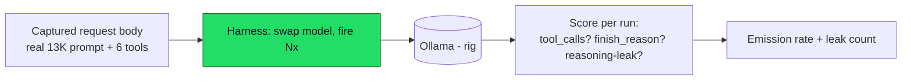
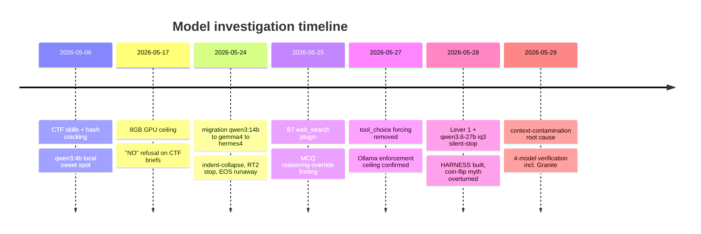

# Harvis — Local-Model Testing & Difficulties Report

**Period:** 2026-05-06 → 2026-05-29
**Hardware:** Laptop 8GB GPU + Rig RTX 5080 (16GB). Linux. Local Ollama (0.24.0).
**Companion doc:** engineering fixes/architecture are in `2026-05-29-engineering-troubleshooting-report.md`.
**Purpose:** a standalone record of every local model we tested, how each one *failed*, and what the measurements actually showed — including the finding that overturned a multi-session assumption.

---

## 1. The one-paragraph story

We spent weeks treating local models as the bottleneck — each new model "failed differently," so we kept swapping. The breakthrough was building a **measurement harness** instead of reasoning from anecdotes. It immediately proved the model we'd written off as a "33% coin-flip" (qwen3.5:9b) was actually **100% reliable on clean context** — and that *every* model, including a different family (IBM Granite), collapsed to **0%** on contaminated context. The variable was never the model. It was the conversation history.

---

## 2. Methodology — the harness

`scripts/diagnostics/model_harness.py` replays a **real captured request body** (the exact ~13K-token prompt + 6 tools OpenClaw sends) against a target model **N times** and scores **tool-call emission rate**. Direct-to-Ollama, no Harvis middleware in the loop — isolating the model.



**Why it mattered:** before the harness, n=1–3 hand tests in Discord produced "vibes" (it worked / it didn't). The harness produces a *rate* over 8 runs — the difference between "qwen3.5:9b feels flaky" and "qwen3.5:9b is 100% on clean / 0% on contaminated."

---

## 3. The headline result — context contamination is universal

Same prompt, same tools, same temperature. **Only the conversation history differs.**

| Model | Family | Clean turn-1 | Contaminated (completed-task in history) |
|---|---|---:|---:|
| qwen3:14b | Qwen | **100%** (5/5) | **0%** (0/5) |
| qwen3.5:9b | Qwen | **100%** (8/8) | **0%** (0/8) |
| granite4.1:8b | IBM (non-Qwen) | **88%** (7/8) | **0%** (0/8) |

```mermaid
xychart-beta
    title "Tool-call emission rate by context state"
    x-axis [qwen3-14b, qwen3.5-9b, granite4.1-8b]
    y-axis "Emission %" 0 --> 100
    bar "clean" [100, 100, 88]
    bar "contaminated" [0, 0, 0]
```



Intermediate gradient (qwen3.5:9b), proving it's the *completed-task signal* specifically — not depth, not the corrective:

| History shape | Emission |
|---|---:|
| Clean turn-1 | 100% (8/8) |
| 1 narration miss + re-ask (no success) | 100% (6/6) |
| narration + CORRECTION (no success) | 100% (8/8) |
| **completed-task turn + tool result present** | **0% (0/8)** |
| rendered-text "cracked successfully" (not structured) | 88% (mild) |

**Reading:** the killer is a *structured* completed-task exchange (assistant "cracked successfully" + a tool result). Rendered text carrying the same words is only a mild nudge (88%). This is why the fix clears the whole session (`sessions.reset`) rather than phrase-matching.

---

## 4. Per-model difficulty profiles



### qwen3:4b — the local sweet spot (early)
- ✅ **100% GPU residency** at 4.3GB on the 8GB laptop; ~100 tok/s; good tool discipline.
- ❌ Returned `"NO"` on CTF briefs (safety-aligned refusal on "password dumps / hacker" framing) — sometimes 0 tool calls in 32s (pure refusal, not capability).

### qwen3:14b — reliable workhorse, MCQ-anchored
- ✅ Hash/CodeAct: deterministic 5/5. Became the production default.
- ❌ **MCQ training-data anchoring:** memorized the wrong OWASP answer ("API Gateway") and *refused to search to verify* — confidently wrong. Runs on the rig (too big for laptop).

### gemma4:e4b — great at MCQ, broke on hash
- ✅ **Volunteers `web_search`** on MCQ shape under `tool_choice=auto` — best of the small models at scenario reasoning.
- ❌ **Indent-collapse:** emitted 1-space indent at every nesting depth inside heredoc Python → `IndentationError`, looped, never converged (the original Lever 1 motivator).
- ❌ **RT2 silent-stop:** after a tool result, emitted ~1 completion token — couldn't summarize (Ollama 0.24.0 chat-template bug).
- 🟢 **Redeemed 2026-05-29:** with Lever 1 (dispatch, no model-authored Python) it cracks 5/5 cleanly + does web search.

### hermes4:14b-q5 — unsuitable at production complexity
- ❌ **Tool-call discipline floor:** at ~24K prompt + many tools, emitted fake ```json``` tool calls as text or pure narration (0 tool_calls).
- ❌ **EOS not honored:** `</s>` / `<|im_end|>` ignored by the template → 2,480-token runaway echoing the system prompt. Fixed with explicit `options.stop` + `num_predict` cap (→ 321 tokens), but the tool-discipline floor remained.
- ⚠️ Hash worked 5/5 *only* because the CodeAct hint forced shape; free-form MCQ inconsistent.

### qwen3.6-27b:iq3 — quant broke tool-use
- ❌ **Silent-stop:** empty completion, ~26–29 tokens vanished into the reasoning channel; `finish_reason=stop`, 0 tool_calls — on BOTH `auto` and pinned `tool_choice`.
- ❌ Default 128K context OOM'd the 16GB rig (had to bake a 16K/24K Modelfile variant); still ~13–22% CPU offload.
- **Verdict:** IQ3 quantization degraded the function-calling decoder. Dropped as a model option.

### qwen3.5:9b — the "flaky" model that wasn't
- ⚠️ **Appeared to coin-flip ~33%** in hand tests → the harness proved this was a sampling artifact: 100% on clean context, 0% only with a completed-task turn (context contamination, not the model).
- ⚠️ **Thinking-channel routing:** puts the final answer in `message.reasoning` with empty `content` — the reasoning→content hoist salvages it.
- 🟡 **Re-authors decode/crypto scripts** instead of dispatching to the skill (works, but 4 calls vs 1) — Lever 1 not yet extended there.

### granite4.1:8b — non-Qwen validation
- ✅ **Different family (IBM), no reasoning channel** — emits clean `exec` tool calls on our production prompt at 88%.
- ✅ Proved the contamination is **model-agnostic**: 0% on the same contaminated body, identical to the Qwen models (its failure surfaces as narration rather than a reasoning leak — same root, different surface).

---

## 5. Model-difficulty matrix

| Failure mode | qwen3:4b | qwen3:14b | gemma4:e4b | hermes4:14b-q5 | qwen3.6:iq3 | qwen3.5:9b | granite4.1:8b |
|---|:-:|:-:|:-:|:-:|:-:|:-:|:-:|
| Fits laptop 8GB GPU | ✅ | ❌ | ✅ | ❌ | ❌ | borderline | ✅ |
| Hash CodeAct (pre-Lever 1) | — | ✅ | ❌ indent | ⚠️ | — | — | — |
| Hash dispatch (post-Lever 1) | — | ✅ | ✅ | — | — | ✅ | ✅ |
| MCQ web_search | ❌ | ❌ anchor | ✅ | ⚠️ | — | — | — |
| Tool-call discipline @ prod complexity | ✅ | ✅ | ⚠️ | ❌ | ❌ | ✅ | ✅ |
| Clean-context emission | — | 100% | (E2E ✅) | — | 0% | 100% | 88% |
| Contaminated-context emission | — | 0% | — | — | 0% | 0% | 0% |
| CTF refusal ("NO") | ❌ | — | — | — | — | — | — |

---

## 6. Key findings & recommendations

1. **Context hygiene > model selection.** The biggest reliability lever was clearing completed-task history, not picking a better model. Fixed once at the infrastructure layer, it helps every model identically.
2. **qwen3.5:9b is NOT flaky** — supersedes the old `model-task-pairing` memory. It's 100% on clean context.
3. **Production default: qwen3:14b** (most consistent across task classes). gemma4:e4b strong for MCQ/scenario. granite4.1:8b a viable non-Qwen option. **Avoid:** hermes4:14b-q5 and IQ3-class 27B (quant breaks tool-use).
4. **Quantization matters for tool-use** — IQ3 broke function-calling on a 27B; Q4_K_M is the practical floor.
5. **Forcing `tool_choice` is futile** on Ollama at production complexity — rely on `auto` + good prompt/skill shape.
6. **Measure, don't guess.** The harness is the durable asset: `python3 scripts/diagnostics/model_harness.py --body <captured request.json> --model <name> --target ollama --ollama-url http://192.168.5.58:11434 --runs 8`. Run it on any new model before trusting Discord anecdotes.

---

*Report generated 2026-05-29. Data: harness measurements (this session), session handoffs (2026-05-17, 2026-05-24, 2026-05-25, 2026-05-28), and Discord E2E logs. Mermaid diagrams render on GitHub / compatible viewers.*
